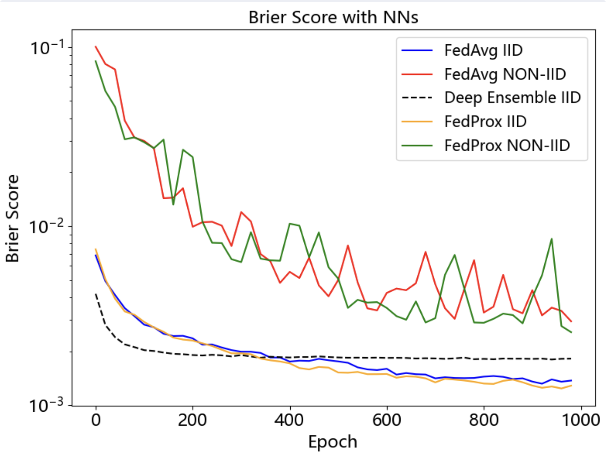

# fl_awesome Project

## Hypothesis

Impact of IID vs. Non-IID Data on Uncertainty Accuracy in Federated Learning

## Technology

- Task: Imagine classification
- Dataset: MNIST

## Get Started

Check and run `experiment.ipynb`

## Result

